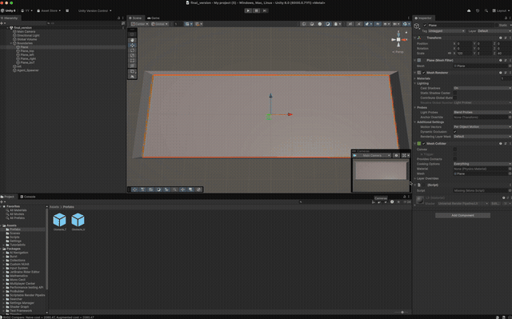

# Unity Path Planning — Reduced Visibility Graph (RVG)

   

A real-time AI path planning system built in Unity implementing a **Reduced Visibility Graph (RVG)** with terrain cost awareness. Agents of configurable sizes navigate dynamically generated obstacle environments using either a classical visibility graph or an augmented probabilistic roadmap variant.

> Built as part of McGill COMP 521 (Modern Computer Games) to explore computational geometry, graph-based path planning, and cost-weighted navigation.

---

## Demo



---

## Technical Highlights

### Reduced Visibility Graph (RVG)
The core of the project is a hand-built visibility graph constructed from obstacle boundary vertices. The graph is built in two phases:

1. **Obstacle expansion** — each obstacle's geometry is inflated by the agent's radius, ensuring that paths computed for a point agent are safe for a finite-radius agent
2. **Bitangent edge construction** — edges are added between pairs of obstacle vertices only if the line-of-sight is unobstructed (raycast / segment intersection test against all expanded obstacles)

The result is a sparse graph containing only the edges needed for optimal navigation around convex obstacle corners.

### Two Pathfinding Modes

| Mode | Description |
|---|---|
| **Naive RVG** | Pure visibility graph — optimal paths along obstacle tangents |
| **Augmented RVG** | Adds random Gaussian samples biased toward low-cost terrain zones, creating a probabilistic roadmap layer on top of the RVG for cost-aware detours |

### Terrain Cost System
The level is partitioned into a **2×3 grid of terrain zones**, each assigned a random traversal cost (0.5–5.0) at startup and color-coded green→red. Edge weights in the RVG are scaled by the terrain cost of the zones they cross, so the agent trades path length for cheaper terrain when using Augmented mode.

### Size-Aware Agents
Three agent sizes (Small, Medium, Large) each have a distinct radius. On spawn, the entire RVG is rebuilt with the new agent radius — obstacle expansion, bitangent checks, and graph connectivity are all radius-dependent, so larger agents automatically navigate through wider corridors only.

### Procedural Obstacle Layout
8–12 T and U shaped obstacles are placed at runtime via rejection sampling with configurable margin and edge clearance. Each obstacle is given a random Y-rotation to prevent grid-aligned degenerate cases that would trivialize path planning.

---

## Architecture

```
AgentSpawner          →  UI (Small / Medium / Large buttons)
    └── SpawnAgent()  →  TryFindValidPosition() (Physics.CheckSphere rejection sampling)
                      →  AgentController.Initialize()
                              └── RVG2.ReadObstaclesFromScene()
                              └── RVG2.buildRVG(agentRadius)
                                      ├── ExpandObstacles()
                                      └── BuildBitangentEdges()
                              └── RVG2.FindPath(start, goal)   ← Dijkstra on weighted graph
                              └── MoveAlongPath(path[])
```

---

## Controls

| Action | Input |
|---|---|
| Spawn Small agent | `Small` button (UI) |
| Spawn Medium agent | `Medium` button (UI) |
| Spawn Large agent | `Large` button (UI) |

Each spawn replaces the previous agent and rebuilds the graph for the new size.

---

## Systems Overview

| System | Script | Key Idea |
|---|---|---|
| Visibility graph | `RVG2` | Obstacle expansion + bitangent edge pruning + Dijkstra |
| Augmented roadmap | `RVG2` (Augmented mode) | Gaussian samples biased to low-cost terrain |
| Terrain cost zones | `obstacles_generation` | 2×3 grid, random costs, color-coded |
| Obstacle placement | `obstacles_generation` | Rejection sampling, T/U prefabs, random rotation |
| Agent navigation | `AgentController` | Coroutine path following, destination markers |
| Agent spawning | `AgentSpawner` | Runtime UI, size-aware, overlap-free placement |

---

## Stack

- **Engine:** Unity 2022.3 LTS
- **Rendering:** Universal Render Pipeline (URP)
- **Pathfinding:** Custom RVG + Augmented PRM (no NavMesh)
- **Language:** C#
